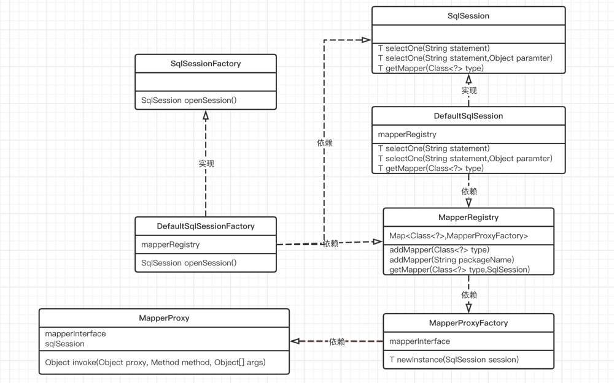

# 自己动手写mybatis系列——small-mybatis-02

类关系图

## 1、MapperProxy
MapperProxy本质上一个代理类。在Mybatis中用来代理我们定义的Mapper接口。
我们使用Mybatis框架只需要定义一个接口就可以查询具体的数据，就是这个接口来代理我们的Mapper接口来处理的。

MapperProxy采用[JDK动态代理](https://www.yuque.com/docs/share/5a64608e-1c5a-40f6-988c-63f40b6bd202?)的方式来代理我们的Mapper接口，因此MapperProxy实现了InvocationHandler接口。

> MapperProxy属性及方法
> - SqlSession：Mybatis中提供的简单查询方法
> - invoke()：实现InvocationHandler类的invoke()方法。当我们执行被代理类的方法时，最终都会执行到此方法，在此方法中会执行SqlSession提供的对应的增删改查方法。

### 1.1、MapperProxyFactory
MapperProxy代理类如果要代理我们的Mapper接口，那么我们每一个Mapper接口都要有一个MapperProxy与之对应。
因此Mybatis提供一个MapperProxyFactory工厂类用来生成Mapper接口对应的代理类MapperProxy。

## 2、MapperRegistry
我们有了MapperProxy代理类，那么我们好缺少被代理类。

一种简单的方式就是手动将每一个Mapper接口创建一个MapperProxy代理类。但是这种方式不灵活。
另一种方式就是Mybatis提供的方式，就是提供一个路径，Mybatis自动将这个路径下的Mapper接口搞创建一个MapperProxy代理类。

MapperRegistry就是一个注册器，用来发现需要代理的Mapper接口。

> MapperRegistry属性
> - knownMapper：用来保存MapperRegistry注册器发现的Mapper接口。
> - addMapper(Class<?> type)：将被代理类type封装成MapperProxy
> - addMapper(String[] packages)：将指定路径下的所有Mapper接口都封装成MapperProxy。

## 3、SqlSession
Mybatis中提供的另一个重要类就是SqlSession。sqlSession中定义了我们熟知的增删改查方法。这些方法就是提供给用户使用的，用来查询数据库的一些方法。

在此阶段，SqlSession只是提供一个简单的查询方法。

> SqlSession方法
> - selectOne(String statement)：执行查询一条数据
> - selectOne(String statement,Object[] params)：带参数的查询
> - getMapper(Class<?> type)：获取指定type的被代理类。